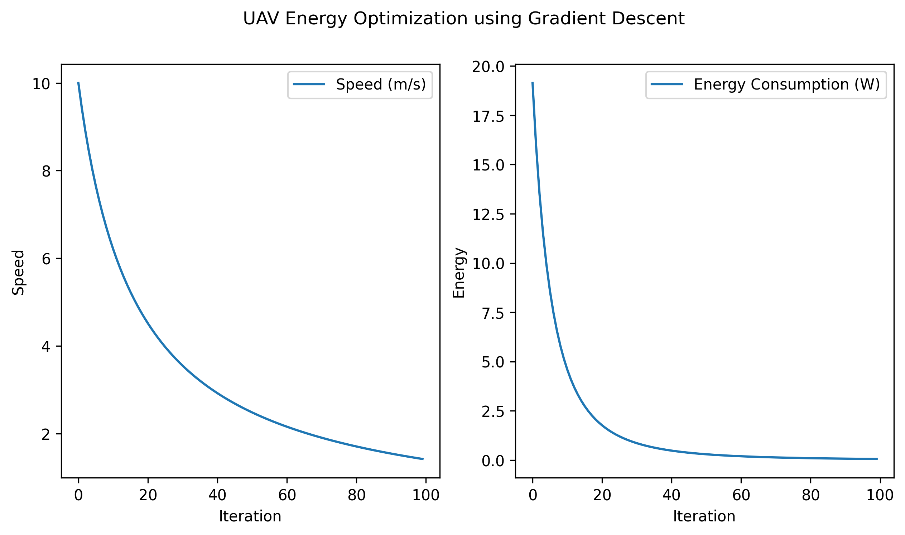

# UAV Energy Optimization using Gradient Descent

---

## Introduction
This project optimizes the energy consumption of an Unmanned Aerial Vehicle (UAV) by adjusting its speed using gradient descent. The goal is to find an optimal balance between speed and energy efficiency.

Designed a gradient descent-based optimization algorithm in a simulation to minimize UAV energy consumption by balancing speed and altitude.

## Mathematical Formulation

### 1. Energy Consumption Model
The power required for the UAV is primarily influenced by aerodynamic drag:

- **Drag Force:**
  $$
  F_d = \frac{1}{2} \rho v^2 A C_d
  $$
  where:
  - \( F_d \) = Drag force (N)
  - \( \rho \) = Air density (kg/m³)
  - \( v \) = UAV speed (m/s)
  - \( A \) = Wing area (m²)
  - \( C_d \) = Drag coefficient (dimensionless)

- **Power Required:**
  $$
  P = \frac{F_d \cdot v}{\eta}
  $$
  where:
  - \( P \) = Power required (W)
  - \( \eta \) = Propulsion efficiency (dimensionless)

### 2. Gradient Descent Optimization
The optimization aims to minimize power consumption by adjusting speed. Using gradient descent:

- **Compute Partial Derivative:**
  $$
  \frac{dP}{dv} = \frac{P(v+\Delta v) - P(v)}{\Delta v}
  $$

- **Update Speed:**
  $$
  v_{new} = v - \alpha \frac{dP}{dv}
  $$
  where \( \alpha \) is the learning rate.

### 3. Iterative Process
The optimization algorithm iteratively updates speed until convergence, minimizing energy consumption.

## Implementation Overview
1. Define the energy consumption model.
2. Compute energy gradients w.r.t speed.
3. Apply gradient descent updates to adjust speed.
4. Visualize speed and energy consumption over iterations.

## Results
The algorithm effectively reduces energy consumption by adjusting UAV speed dynamically. Plots illustrate the speed variation and power reduction over iterations.

## Visualization

Below is a graphical representation of the optimization process:

**Figure 1.1:** Speed variation and energy consumption reduction over iterations.

## Conclusion
This approach demonstrates a mathematical and computational method to optimize UAV energy efficiency, leveraging physics-based modeling and numerical optimization.

